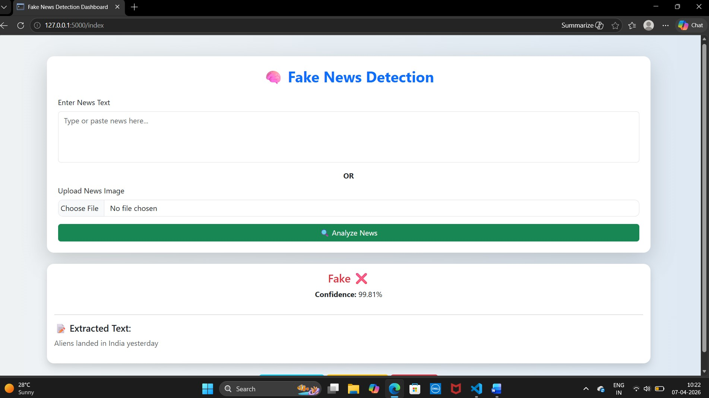
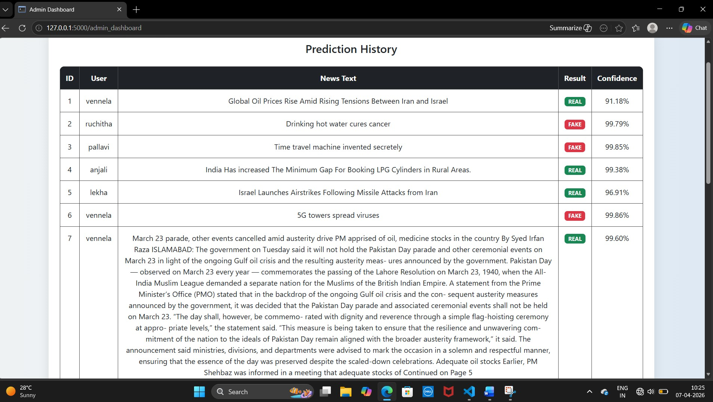
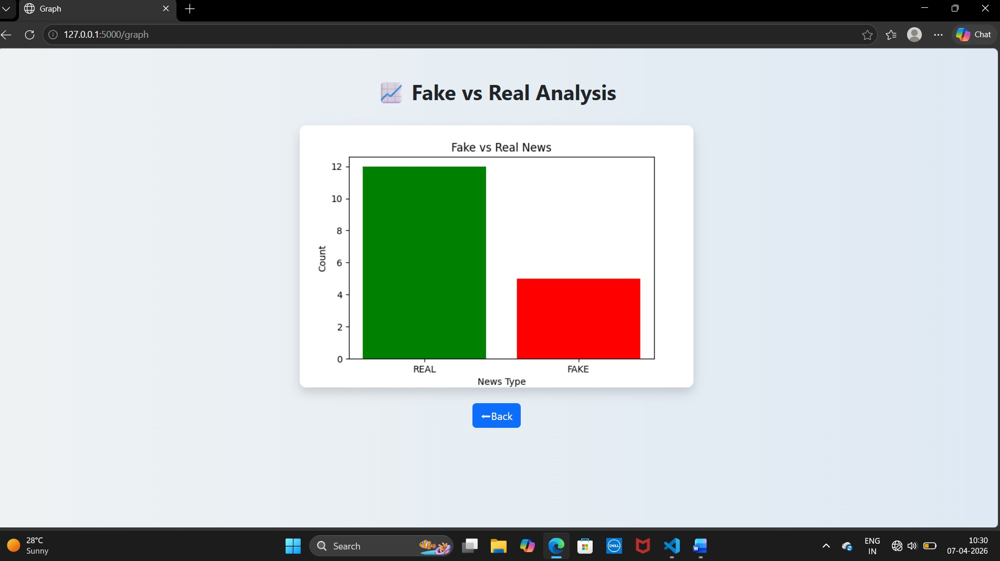

# AUTOMATED FAKE NEWS DETECTION USING TRANSFORMER MODELS

# Project Overview
Automated Fake News Detection using Transformer Models is a web-based intelligent system developed to identify whether a news article is **REAL** or **FAKE** using advanced Natural Language Processing (NLP) techniques and Transformer-based deep learning models.The application uses the BERT (Bidirectional Encoder Representations from Transformers) model for accurate classification of news content.The system provides a user-friendly interface with separate modules for users and administrators.The project is designed to help reduce misinformation spread across digital platforms by providing reliable news verification.

# Features
## User Module:
- User Registration and Login
- Detect Fake or Real News
- Upload News Text
- OCR-based Fake News Detection from Images
- View Prediction Result
- Confidence Score Display
- User Prediction history
  
## Admin Module:
- Secure Admin Login
- View Registered Users
- View Prediction History
- Analyze Graph Reports
- Dashboard Interface

## Analytics & Visualization
- Fake vs Real News Graph
- Classification Report Graph
- Accuracy Analysis
- Prediction Statistics

## OCR Integration
The project integrates Tesseract OCR to extract text from uploaded news images and screenshots.  
The extracted text is then analyzed using the BERT Transformer model to predict whether the news is REAL or FAKE.

## OCR Workflow
Image Upload → Text Extraction → Fake News Prediction → Result Display

## Transformer Model Used
- **BERT (Bidirectional Encoder Representations from Transformers)**.
The transformer model is trained using labeled fake and real news datasets for accurate classification and contextual understanding of news articles.

# Technologies used
## |Technology | Purpose |
| Python | Backend Development|
| Flask |  Web Framework |
| HTML/CSS | Frontend Design |
| Bootstrap | Responsive UI |
| JavaScript | Dynamic Interaction |
| MySQL | Database |
| Transformers(BERT) | Fake News Detection |
| Tesseract OCR | Text Extraction from Images| 
| Scikit-learn | Performance Evaluation |
| Pandas | Data Processing |
| Matplotlib | Graph Visualization |

# 📂 Project Structure
```bash
Fake-News-Detection/
│
├── app.py
├── templates/
├── static/
├── model/
├── requirements.txt
└── README.md
```

# Installation and Setup
### 1️⃣ Clone Repository
git clone https://github.com/kathurivennela/Fake-News-Detection.git
### 2️⃣ Open Project Directory
cd Fake-News-Detection
### 3️⃣ Install Required Libraries
pip install -r requirements.txt
### 4️⃣ Run Flask Application
python app.py
### 5️⃣ Open in Browser
http://127.0.0.1:5000/


## 📊 Model Performance
### | Metric | Score |
| Accuracy | 100% |
| Precision | 100% |
| Recall | 100% |
| F1-Score | 100% |


# Project Screenshots
### 🏠 Home Page


### 👤 User Dashboard


###  News Detection Dashboard


### Admin Dashboard


### Prediction History


### 📈 Graph Analytics


# Future Enhancements
- Real-time News API Integration
- Multi-language Fake News Detection
- AI-based News Summarization
- Dark Mode Interface
- Advanced Analytics Dashboard
- Email Notifications

#  Developed By
## Kathuri Vennela

#  License
This project is developed for educational and academic purposes only.
